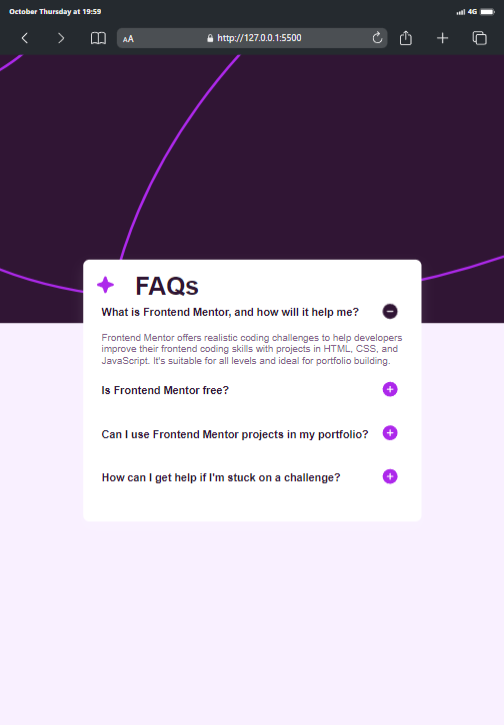

# Frontend Mentor - FAQ accordion solution

This is a solution to the
[FAQ accordion challenge on Frontend Mentor](https://www.frontendmentor.io/challenges/faq-accordion-wyfFdeBwBz).
Frontend Mentor challenges help you improve your coding skills by building
realistic projects.

## Table of contents

- [Overview](#overview)
  - [The challenge](#the-challenge)
  - [Screenshot](#screenshot)
  - [Links](#links)
- [My process](#my-process)
  - [Built with](#built-with)
  - [What I learned](#what-i-learned)
  - [Continued development](#continued-development)
  - [Useful resources](#useful-resources)
- [Author](#author)
- [Acknowledgments](#acknowledgments)

## Overview

### The challenge

Users should be able to:

- Toggle the answer to a question when the question is clicked
- Navigate the questions and hide/show answers using keyboard navigation alone
- View the optimal layout for the interface depending on their device's screen
  size
- See hover and focus states for all interactive elements on the page

### Screenshot




### Links

- Solution URL:
  [Faq Accordion](https://github.com/Mubarak-Adeyemi/Faq-accordion-main)
- Live Site URL:
  [Faq Accordion](https://mubarak-adeyemi.github.io/Faq-accordion-main/)

## My process

### Built with

- Semantic HTML5 markup
- CSS custom properties (variables)
- Flexbox for layout and alignment
- Mobile-first workflow
- Vanilla JavaScript for interactivity
- Accessibility features using aria attributes

### What I learned

In this project, I focused on creating an accessible and interactive FAQ section
with clean, modular JavaScript. The main challenge was ensuring that the
accordion functionality worked seamlessly while maintaining proper ARIA
attributes for accessibility.

Some notable code snippets:

- HTML Structure:

```html
<h2>
  <button aria-expanded="false" aria-controls="faq1">
    What is Frontend Mentor?
  </button>
</h2>
```

- CSS Transition for FAQ:

```css
.faq-answer {
  max-height: 0;
  overflow: hidden;
  transition: max-height 0.3s ease-in-out;
}
```

- JavaScript for Event Delegation:

```js
faqContainer.addEventListener("click", (event) => {
  const clickedButton = event.target.closest("button");
  if (clickedButton) {
    toggleFAQ(clickedButton);
  }
});
```

Through this project, I enhanced my understanding of:

- Event delegation and ensuring smooth DOM manipulation
- Managing state toggling using classList.add/remove and ARIA attributes for
  accessibility
- Ensuring that only one FAQ is expanded at a time for a clean user experience

### Continued Development

Going forward, I plan to refine the following concepts and techniques:

- ARIA attributes: I aim to explore more ways to make web components fully
  accessible.
- CSS animations: I want to improve the smoothness of transitions for better
  user interaction.
- JavaScript optimization: Understanding more efficient ways to manipulate the
  DOM.

### Useful resources

- [YouTube Video on Animations](https://youtu.be/4qnWreynXLU?si=qW6XmPueJttaTAxl) -
  This video helped me implement smooth animations for the accordion.
- Jona's Paid Course - I learned how to efficiently use event delegation from
  Jona's course, which greatly simplified my JavaScript logic..

## Author

- Frontend Mentor -
  [Mubarak-Adeyemi](https://www.frontendmentor.io/profile/Mubarak-Adeyemi)
- Twitter - [@mubarakElarabiy](https://www.twitter.com/@mubarakElarabiy)

## Acknowledgments

A special thanks to the Frontend Mentor community for their support and feedback
during this project. The guidance on improving accessibility and user experience
was invaluable.
